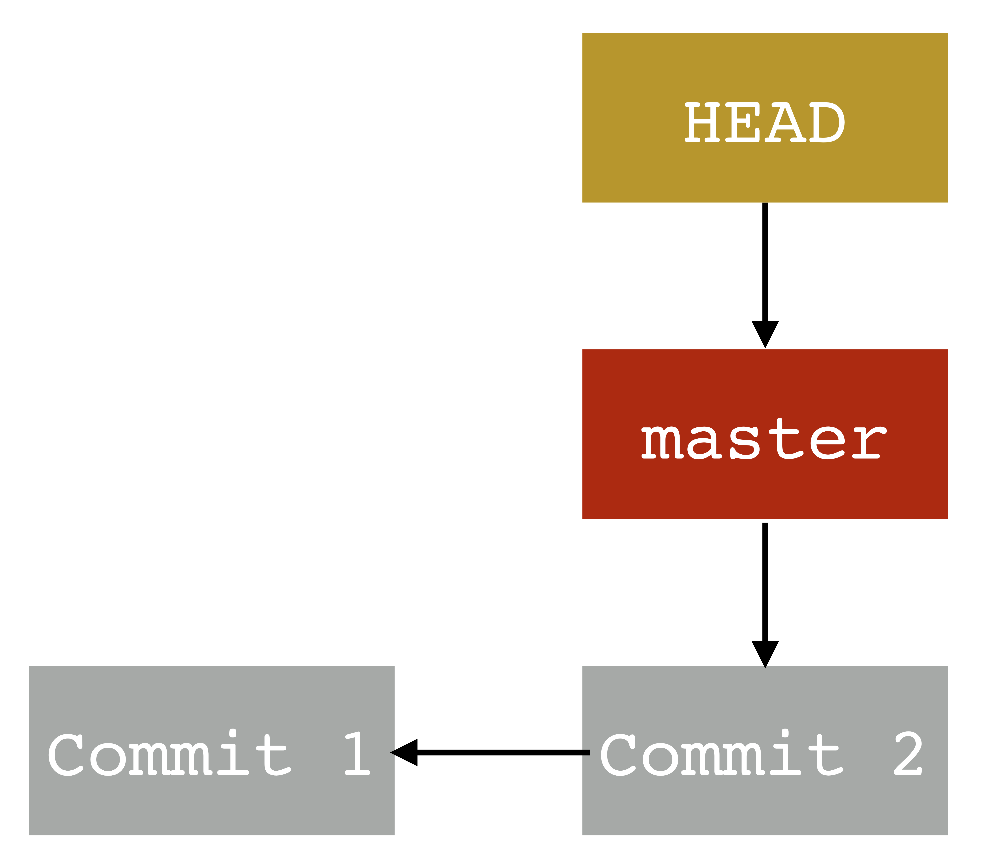
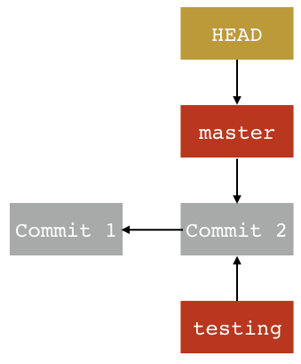
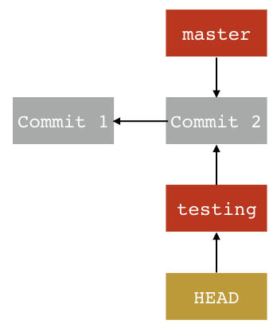
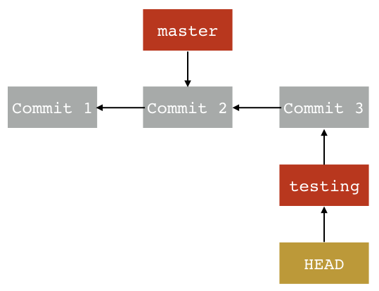
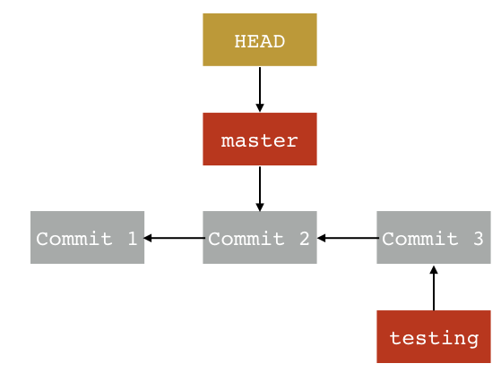
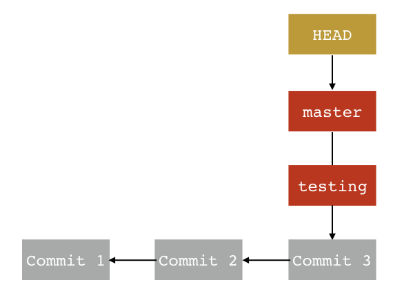

# Cancer Modeling Group - Git Tutorial


## Description
A Git and GitHub tutorial for the UW Cancer Modeling Group's meeting on 4/26/22. Much of the tutorial is taken and adapted from the Git documentation's tutorials [1](https://git-scm.com/docs/gittutorial) and [2](https://git-scm.com/docs/gittutorial-2). This tutorial will cover the basics of 
- staging & commits (init, add, and commit)
- branches
- examining changes (`git diff`)
- remotes & GitHub
- .gitignore files
- Git terminology

Basic features of Git:
- version control software
- free, fast, and open-source
- operates locally
- enables many different workflows

<b>Figure: Subversion style workflow (from [Git documentation](https://git-scm.com/about/distributed))</b>


<b>Figure: Integration manager workflow (from [Git documentation](https://git-scm.com/about/distributed))</b>
 

Basic features of GitHub:
- collaborative version control and hosting for software development
- hosts many open-source projects
- interfaces with Git workflows and commands
- advanced features like issue tracking, wikis, discussions, etc

## Getting started
You'll want to create a GitHub account if you don't have one. And there's the Bozic-Group organization you can join!
https://github.com/Bozic-Group
It has group members' simulations, tutorials, and more.

Make sure you have Git installed on your computer ([instructions](https://git-scm.com/book/en/v2/Getting-Started-Installing-Git) for all operating systems). It's recommended to add your name and email to the Git configuration, if you haven't. First you can check if you have already set this up:
``` 
$ git config --list 
```
If not, set them:
```
$ git config --global user.name "Your Name Comes Here"
$ git config --global user.email you@yourdomain.example.com
```

To get the manual page for a Git command, e.g. clone
```
$ git help clone
```

## init and making your first commit
The basic process of commits:
1. `git add` add changes made in the working tree to the staging area (staged for a subsequent commit)
- when file content is staged, SHA-1 checksum (often called the "hash") is computed for each file. Is like an ID for the commit.
2. `git commit`: Git stores a commit object. From the [branching docs](https://git-scm.com/book/en/v2/Git-Branching-Branches-in-a-Nutshell):
- commit object is a pointer to the snapshot of staged content and contains:
    - blob: contents of file
    - tree: list of the directory's content, and tracks which files are associated with which blobs.
    - a commit with a pointer to the prior commit(s) and commit metadata


<b>Figure: commit objects for an initial commit. From the [branching docs](https://git-scm.com/book/en/v2/Git-Branching-Branches-in-a-Nutshell). </b>


<b>Figure: commits for multiple commits. From the [branching docs](https://git-scm.com/book/en/v2/Git-Branching-Branches-in-a-Nutshell). </b>

Let's say you have a new project you want to add to version control. Let's create a directory and text file.
```
$ mkdir new_project
$ cd new_project
$ echo "new project" > a.txt
```
Now initialize the Git repository and inspect the repo 
```
$ git init
$ git status
```
Let's also examine what files have been added now that we're tracking the directory.
```
$ ls -a
```
Note, to delete tracking history for a repository, you just need to delete the `.git` directory.


<b>Figure: staging and committing (from [about Git documentation](https://git-scm.com/about/staging-area))</b>
Let's stage the file contents we want to be staged (and inspect the repo)
```
$ git add a.txt
$ git status
```
Now let's commit this file with a short, descriptive message (using `-m` flag). 
```
$ git commit -m "initalizing repo"
$ git status
```
Note, you can skip the staging step by using `git commit` with the `-a` flag.

<b>Figure: commit without running `git add` (from [about Git documentation](https://git-scm.com/about/staging-area))</b>

We will add another line to the a.txt file and commit the change using this method:

```
$ echo "second commit" >> a.txt
$ git commit -a -m "added second line"
$ git log --pretty=oneline
```


## Branches


<b>Figure: From the [branching docs](https://git-scm.com/book/en/v2/Git-Branching-Branches-in-a-Nutshell)</b>

I'll give just a brief introduction to branches. Some common terms you'll encounter:
- **branch**: pointer to a specific commit
    - **master**: default branch name. Created by default when you run `git init`.
- **HEAD**: "symbolic reference to the branch you’re currently on" [[1](https://git-scm.com/book/en/v2/Git-Internals-Git-References)].


Back to our new_project example. We have one branch (master):



Let's add a second branch called "testing". 
```
$ git branch testing
```
Let's see what the Git log looks like (`--decorate` shows the branch pointers):
```
$ git log --oneline --decorate
```
The new commit structure will look like this



Now switch to the testing branch:
```
$ git checkout testing
```
We can see that HEAD points to the testing branch now
```
$ git log --oneline --decorate
```


Now let's make a change and commit while on the testing branch.
```
$ echo "changes for tests" >> a.txt
$ git commit -a -m 'testing something out'
```
HEAD keeps moving forward with the additional commits. Our commit history looks like this now:


First, let's note the contents of a.txt (`cat a.txt`), and let's go back to master.
``` 
$ git checkout master
```


<b> Note: changing branches in Git changes the files in your working directory. </b>

Now let's say we like what we did in commit 3, see that it didn't break anything, and want to merge that testing branch with master.  
```
$ git merge testing
```


We don't need the testing branch anymore (it's the same as master), so we can delete it:
```
$ git branch -d testing
```
That was a simple example of merging, but it can be more complicated depending on the differences in the branches. See the [documentation](https://git-scm.com/book/en/v2/Git-Branching-Basic-Branching-and-Merging) on merging for more information.

## Examining changes (`git diff`)
Let's add another line to a.txt:
```
$ echo "change for diff" >> a.txt
```
We can see the differences between our working tree (which we modified)) and HEAD.
```
$ git diff HEAD
```
Breaking down the output. This shows the input files to git diff:
```
$ diff --git a/a.txt b/a.txt
```
This shows that the `-` symbol has been assigned to the a input source and `+` has been assigned to the b input source:
```
--- a/a.txt
+++ b/a.txt
```
This shows that for input source a (HEAD), the output displays 3 lines, starting at line 1. It displays 4 lines, starting at line 1 for input source b (working tree):
```
@@ -1,3 +1,4 @@
```
This shows that for input source b (working tree), we added the line "change for diff":
```
 new project
 second commit
 changes for tests
+change for diff
```

## remotes & GitHub
We can use GitHub to host code, contribute to others' projects, and let others use/modify our code. GitHub has quite a bit of functionality with its web interface. 

### Cloning an existing repository (local or remote)
To clone (copy an existing repository and initialize the repository) a repository, `git clone <repo>`. For example, to clone the Git linkable library `libgit2` and rename our local repository `mylibgit`:
```
$ git clone https://github.com/libgit2/libgit2 mylibgit
```

You'll come across the word "origin" often. "origin" is an alias for the remote. To see what origin refers to, run
```
$ git remote -v
```
If you have cloned a repository, then it should point to that remote repository. Let's say we think a file is missing from this repository. Let's create, add, and commit this file first,
```
$ echo "missing line" > missing_file.txt
$ git add missing_file.txt
$ git commit -m "added missing file"
```
First fetch the remote to make sure our remote is up to date, in case someone added the missing file already.  
```
$ git fetch origin
```
<b>Note</b>, `git pull` is a shortcut for `git fetch` followed by `git merge`. Probably best to avoid using `git pull`, instead use fetch and merge ([1](https://longair.net/blog/2009/04/16/git-fetch-and-merge/)). Compare our local repo with the fetched remote:
```
$ git diff --summary FETCH_HEAD
```

### GitHub CLI
GitHub also has a command line interface called GitHub CLI ([installation instructions](https://github.com/cli/cli#installation)). You can use it to add local repositories to GitHub. To add our new_project repo to our GitHub account, run
```
$ gh repo create
```
and follow the interactive prompts. 


## .gitignore file
There are some files you don't want to be tracked, e.g. private keys, certain system files, large files (GitHub repo limit is 10 GB). Include a `.gitignore` file [[documentation](https://git-scm.com/docs/gitignore)] with the files that Git should ignore. There are [many templates](https://github.com/github/gitignore) out there, depending on your programming language, operating system, etc.

<b>Note, be careful about files you commit in repos that are public or could be public eventually. Even if you delete a file that has already been committed, someone could go through the commit history to find it. And it's not trivial to completely remove a file from the commit history (see resources [[6](https://stackoverflow.com/questions/2100907/how-to-remove-delete-a-large-file-from-commit-history-in-the-git-repository),[7](https://stackoverflow.com/questions/43762338/how-to-remove-file-from-git-history)] at the end of the tutorial for ways to do this). </b>

Mac users have to be careful about hidden files (starting with `.`) that the system generates automatically, like the `.DS_Store` file ([interesting article](https://cybernews.com/security/microsoft-vancouver-leaking-website-credentials-via-overlooked-ds-store-file/) about this file). 

## Common commands we covered, going from most basic/essential to more advanced features 
1a. minimal set of command for version control: 
-  add
- commit

1b. minimal set of commands for examining commits
- status
- log

1c. minimal set of commands to copy remote repository
- clone

2a. more complicated workflows using branches and merging
- branch
- checkout
- merge

2b. Examining differences in files 
- diff 

2c. More options for interacting with remotes
- push
- pull
- fetch

## Additional resources

- Git user manual [[1](https://git-scm.com/docs/user-manual)]
- Everyday Git with 20 Commands [[2](https://git-scm.com/docs/giteveryday)]
- Differences between fetch and pull [[3](https://stackoverflow.com/questions/292357/what-is-the-difference-between-git-pull-and-git-fetch)]
- Good diagrams of git commands [[4](https://blog.osteele.com/2008/05/my-git-workflow/)]
- many useful .gitignore files [[5](https://github.com/github/gitignore)]
- useful threads if you're unlucky and have to remove something from your commit history [[6](https://stackoverflow.com/questions/2100907/how-to-remove-delete-a-large-file-from-commit-history-in-the-git-repository),[7](https://stackoverflow.com/questions/43762338/how-to-remove-file-from-git-history)]
- How to cache your GitHub credentials [[8](https://docs.github.com/en/get-started/getting-started-with-git/caching-your-github-credentials-in-git)]
- git tutorials from the documentation, parts [1](https://git-scm.com/docs/gittutorial) and [2](https://git-scm.com/docs/gittutorial-2)